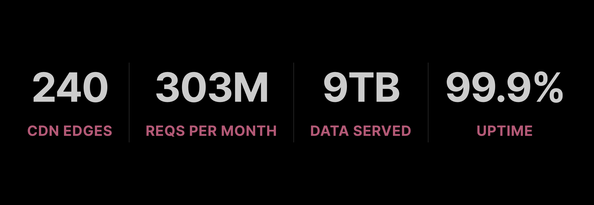

<div align="center">
  
  
</div>

# top-user-agents


[](https://www.npmjs.org/package/top-user-agents)

> An always up-to-date list of the top 100 HTTP [user-agent](https://developer.mozilla.org/en-US/docs/Web/HTTP/Headers/User-Agent) strings most used over the Internet.

## Highlights

- **Always fresh**: Auto-updated weekly from real-world traffic data
- **Battle-tested**: Based on [+300M monthly requests](https://analytics.microlink.io/) from [microlink.io](https://microlink.io)
- **Flexible**: Get all user-agents, or filter by desktop/mobile
- **Zero dependencies**: Lightweight and fast
- **TypeScript ready**: Includes type definitions

**Download**: [All](https://cdn.jsdelivr.net/gh/microlinkhq/top-user-agents@master/src/index.json) · [Desktop](https://cdn.jsdelivr.net/gh/microlinkhq/top-user-agents@master/src/desktop.json) · [Mobile](https://cdn.jsdelivr.net/gh/microlinkhq/top-user-agents@master/src/mobile.json)

## Why top-user-agents?

When performing HTTP requests that need to look like real browser traffic (web scraping, testing, automation), you need accurate and current user-agent strings.



Most user-agent lists on the Internet are **outdated** or **unmaintained**. This list is different:

- Collected from real traffic at [microlink.io](https://microlink.io) (+300M requests/month)
- Automatically updated via CI/CD pipeline
- Covers Chrome, Firefox, Safari, Edge, and more

## Install

```bash
npm install top-user-agents
```

## Usage

### Get a random user-agent

```js
const uniqueRandomArray = require('unique-random-array')
const userAgents = require('top-user-agents')

const randomUserAgent = uniqueRandomArray(userAgents)

console.log(randomUserAgent())
// => 'Mozilla/5.0 (Macintosh; Intel Mac OS X 10_15_7) AppleWebKit/537.36 (KHTML, like Gecko) Chrome/120.0.0.0 Safari/537.36'
```

### Filter by device type

```js
// Desktop browsers only
const desktopAgents = require('top-user-agents/desktop')

// Mobile browsers only
const mobileAgents = require('top-user-agents/mobile')
```

### Use with fetch/HTTP requests

```js
const userAgents = require('top-user-agents')

const response = await fetch('https://example.com', {
  headers: {
    'User-Agent': userAgents[0]
  }
})
```

## About Privacy

The information exposed to the user-agent only relies on coarse details.

In practice, anyone can put whatever they want in the user-agent string, and send it to the web server.

Because that, The user-agent cannot be sufficient condition to identify or reproduce the original request.

## Related

- [https-tls](https://github.com/Kikobeats/https-tls) – Setup TLS fingerprints to match user-agent strings.
- [@microlink/ua](https://github.com/microlinkhq/ua) – Redis primitives for tracking and ranking user-agents.

## License

**top-user-agents** © [microlink.io](https://microlink.io), released under the [MIT](https://github.com/microlinkhq/top-user-agents/blob/master/LICENSE.md) License.<br>
Authored and maintained by [Kiko Beats](https://kikobeats.com) with help from [contributors](https://github.com/microlinkhq/top-user-agents/contributors).

> [microlink.io](https://microlink.io) · GitHub [microlink.io](https://github.com/microlinkhq) · X [@microlinkhq](https://x.com/microlinkhq)
